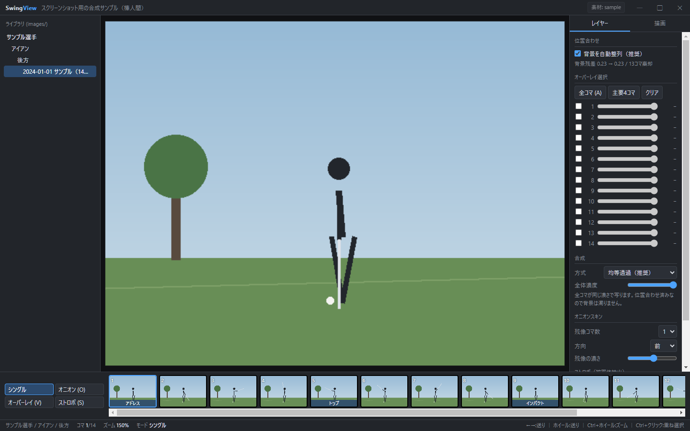
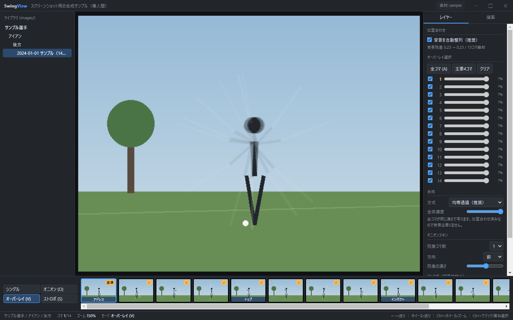
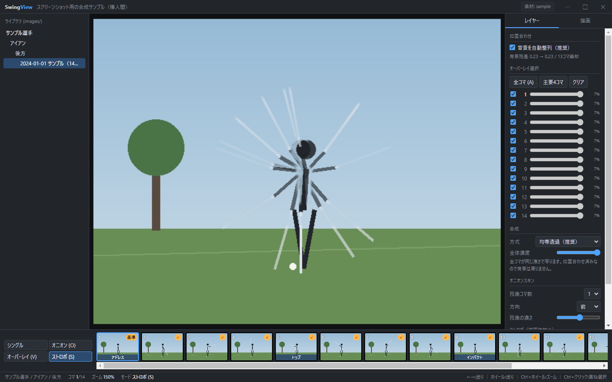
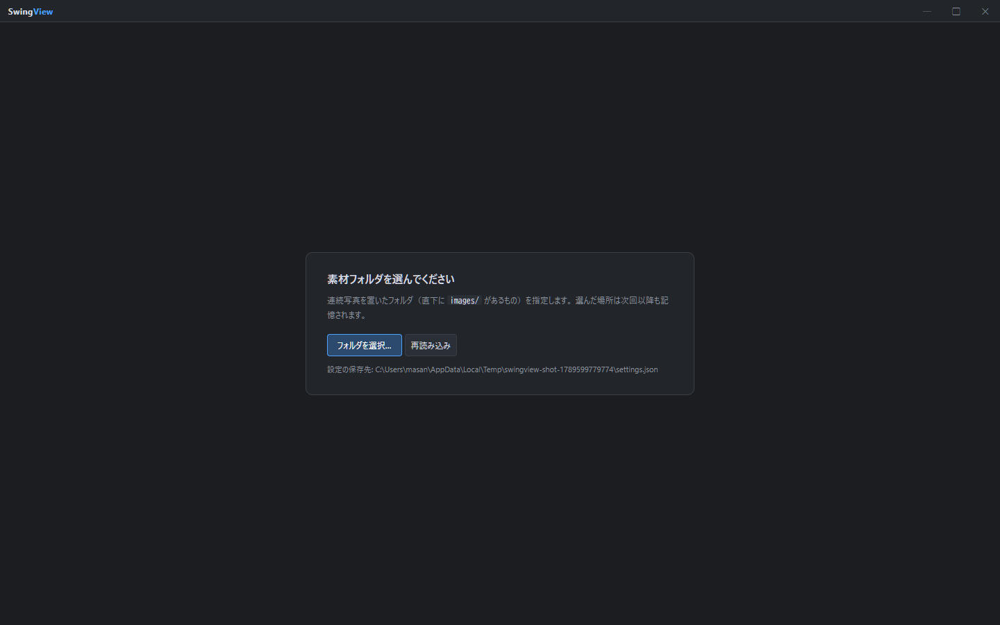

# SwingView

ゴルフスイングの連続写真を重ねて見るためのデスクトップアプリ（Electron + React + TypeScript）。

連続写真は1コマずつ眺めても差が分かりにくい。背景を合わせて複数コマを重ね、
基準線を引いて初めて「どこが違うのか」が見える。それをやるためのビューワー。



左がライブラリ（選手 / クラブ / 方向 / アルバムの4階層）、下がフィルムストリップ、
右がレイヤーと描画のパネル。主要4コマ（アドレス・トップ・インパクト・フィニッシュ）は
サムネイルにラベルが付く。

> 掲載しているスクリーンショットは、権利の制約が無い**合成のサンプルアルバム**（棒人間）で
> 撮ったもの。実際には連続写真を表示する。

## 表示モード

| モード | 何をするか |
|---|---|
| シングル | 1コマずつ確認する |
| オニオン | 前後のコマを薄く重ね、直前との差を見る |
| オーバーレイ | 選んだコマを**全部同じ濃さ**で重ねる（比較明／比較暗／差の絶対値も選べる） |
| ストロボ | 背景を推定して除去し、動いている体とクラブだけを重ねる |

### オーバーレイ



14コマ全部を重ねた状態。右のレイヤー一覧が示すとおり、どのコマも寄与は 7%（= 1/14）で
均等になる。クラブの軌跡が扇状に残り、トップとインパクトの位置関係が一目で分かる。

### ストロボ



背景を推定して引き算し、動いている部分だけを重ねる。背景が濁らないので、
オーバーレイより多くのコマを重ねても潰れない。

重ねる前に背景の位置合わせが要る。ズレたまま重ねても軌跡が読めないので、
アルバムごとに事前計算したオフセットがあればそれを使って揃える。

## 使い始める

### 必要なもの

- Node.js 20 以上
- 表示する素材（このリポジトリには**入っていない**）

動作確認は Windows で行っている。`npm run dist` は Windows インストーラのみ設定済み。

### 素材（データルート）

アプリは画像を持たず、**データルート**として指定したフォルダを読むだけ。

```
<データルート>/
  images/
    library.json                        ← アプリが読む索引（必須）
    <選手>/<クラブ>/<方向>/<アルバム>/
      01.jpg 02.jpg 03.jpg …            ← 時系列のコマ
      annotations.json                  ← アプリが書く注釈（自動生成）
      derived/alignment.json            ← 位置合わせ（任意）
  videos/                               ← 任意
```

初回起動でフォルダ選択画面が出る。



選んだ場所は `userData/settings.json` に覚えるので、次からは素通りする。タイトルバー右の「素材: …」からいつでも切り替えられる。
固定したいときは環境変数が最優先（このときUIからは変更できない）。

```bash
SWINGVIEW_DATA_ROOT=D:/swing-data npm run dev
```

### library.json

アプリが最初に読む索引。これが無いとセットアップ画面から先に進まない。
正確な仕様は `src/shared/types.ts` の `Library` 型だが、最小構成はこれだけ:

```json
{
  "version": 1,
  "albums": [
    {
      "dir": "images/選手名/アイアン/後方/2024-01-01_a001",
      "player": "選手名",
      "club": "アイアン",
      "direction": "後方",
      "situation": "練習場",
      "published_date": "2024-01-01",
      "album_id": "a001",
      "album_title": "一覧に出す表示名",
      "frames": ["01.jpg", "02.jpg", "03.jpg"],
      "width": 1200,
      "height": 800,
      "has_background": false
    }
  ]
}
```

- `dir` … データルートからの相対パス。区切りは `/`（Windows でも `\` にしない）
- `frames` … **時系列順**のファイル名。この並びがそのままコマ送りの順になる
- `player` / `club` / `direction` … 左のツリーの3階層。値は自由文字列
- `alignment` と `keyframes` は任意。無ければ位置合わせ無し・主要4コマは割合で近似する

## 開発

```bash
npm install
npm run dev          # 開発（HMR）
npm run typecheck    # 型チェック（main / renderer）
npm run build        # out/ にビルド
npm run pack         # 展開のみ（dist/win-unpacked）
npm run dist         # Windows インストーラ（dist/）
```

```
src/
  main/       Electron main（Node）
    index.ts    ウィンドウ / IPC / swing: プロトコル / データルート設定
  preload/    contextBridge で window.swing を公開
  shared/     main と renderer で共有する型（library.json の形に対応）
  renderer/   React + TS（Zustand）
    src/App.tsx                  レイアウト・ライブラリツリー・フィルムストリップ・キー操作
    src/store.ts                 状態と合成ロジック（均等透過の重み計算など）
    src/components/Stage.tsx     表示4モード・ズーム/パン・注釈描画・ストロボ合成
    src/components/SidePanel.tsx レイヤー / 描画パネル
    src/components/Setup.tsx     初回のデータルート選択
    src/components/Titlebar.tsx  フレームレス用の自前タイトルバー
```

## 操作

| キー | 動作 |
|---|---|
| `←` `→` / ホイール | コマ送り |
| `Home` `End` | 先頭 / 末尾 |
| `1`〜`9` `0` | コマ直接ジャンプ |
| `O` / `V` / `S` | オニオン / オーバーレイ / ストロボ 切替 |
| `A` | 全コマ選択 / 解除 |
| `L` `C` `H` `G` | 直線 / 円 / 水平線 / 垂直線 |
| `Esc` | ツール解除（パンに戻る） |
| `Ctrl+Z` | 元に戻す |
| `Ctrl+ホイール` | ズーム |
| `Ctrl+クリック`（サムネイル） | 重ね合わせ選択 |

## 設計メモ

### 重ね合わせの濃度

一定の不透明度を全レイヤーに与えると、寄与が指数的に減衰して古いコマが事実上消える。
0.55 固定なら10コマ目の寄与は 0.1% 未満で、「重ねたのに最初のコマが見えない」という状態になる。

そこで**下から k 番目のレイヤーに `1/(k+1)`** を与える。アルファ合成の結果、
どのコマも `1/n` ずつ寄与する。サイドパネルは不透明度ではなく**実際の寄与率**を表示する。

### 画像の配り方（`swing:` プロトコル）

`file://` で読むと `webSecurity` を緩める必要が出る。代わりに専用スキームを登録し、
main 側で配信する。**データルート外へ出る要求は main で弾く**ので、
レンダラーから任意のファイルは読めない。

```
swing://asset/images/<選手>/<クラブ>/<方向>/<アルバム>/01.jpg
```

日本語パスがあるので preload で要素ごとに `encodeURIComponent` し、main 側で戻す。

### フレームレスウィンドウ

OS の枠を出さず（`frame: false`）、タイトルバーはレンダラーで描く。
`.titlebar` と空き領域 `.titledrag` に `-webkit-app-region: drag` を当ててウィンドウ移動、
最小化 / 最大化 / 閉じるは `win:*` の IPC で main に投げる。
バー上のボタンは `no-drag` を当てないとクリックがドラッグに吸われる。

### 注釈の保存先

アルバム内 `annotations.json`（座標は 0..1 の正規化値）。
描画のたびに 400ms デバウンスで書き込む。アルバムと一緒に持ち運べる。

## 未実装

- **動画取り込み画面**（動画から範囲を指定して連続写真を起こす）。現状はアプリ外で用意する
- 動画由来アルバムの**動画再生**とコマ送り
- PNG 書き出し / コンタクトシート
- セッション復元（最後に開いたアルバム・ビュー状態）
- 姿勢推定によるキーフレームの自動判定

## 素材の扱い

このリポジトリに含まれるのはアプリのコードだけで、画像・動画は同梱しない。
アプリは指定されたデータルートを読むだけで、素材の取得は一切行わない。
素材の権利関係（取得元の利用規約・著作権）は利用者の責任範囲とする。

## ライセンス

個人用途で作っているもので、ライセンスは付けていない（UNLICENSED）。
